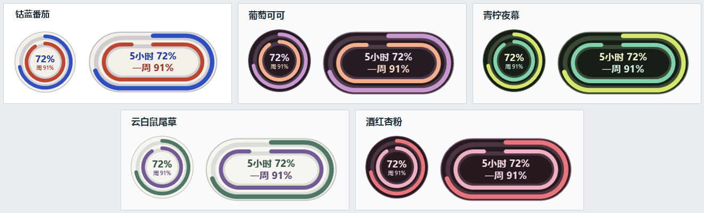
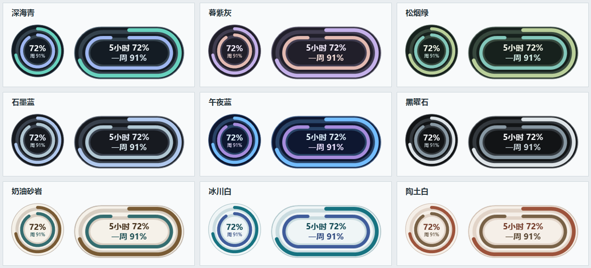

# Codex 额度小组件（Windows）

一个常驻桌面的迷你小组件，显示 Codex 五小时和一周额度的剩余比例及恢复时间，并查看本机任务的 Token 用量。

仓库还提供 [Windows 11 小组件面板适配](WindowsWidgets/README.md)：从任务栏天气入口进入小组件面板后，可固定额度卡片。它与桌面悬浮版分别安装和使用。

## 运行条件

- Windows 10/11、Windows PowerShell 5.1。
- 已登录的 Codex 桌面版或可用的 `codex` 命令。
- Node.js 18 或更新版本，且 `node.exe` 位于 `PATH` 或默认安装目录。

## 使用

只需下载 `CodexQuotaWidget.exe` 并双击启动。若要直接运行源码，则把 `CodexQuotaWidget.ps1`、`data.js` 和 `CodexQuotaWidget.ico` 放在同一文件夹，再使用 `启动小组件.vbs` 或 `启动小组件.cmd`。启动器会隐藏 PowerShell 控制台；小组件和通知区域仍可访问。首次读取通常需要数秒，之后每 60 秒只刷新额度。任务 Token 在打开详情时读取，五分钟内重复打开会复用结果；重复启动不会创建第二个小组件。

`.exe` 已内置小组件脚本、数据脚本和图标，可以单独下载。首次运行会将这些文件放在当前用户的 `%LOCALAPPDATA%\CodexQuotaWidget` 文件夹，设置也保存在那里；不会修改系统安装。额度查询仍依赖已安装的 Codex 和 Node.js。可用 Windows PowerShell 5.1 运行 `build-exe.ps1`，从 `WidgetLauncher.cs` 和同目录源码重新编译。

更新 `.exe` 后，先从小组件右键菜单退出旧实例，再运行新版，让新脚本生效。

当前 `.exe` 未使用代码签名证书，Windows 下载后可能显示发布者未知。可用仓库里的源码和构建脚本自行核对并重新编译。

启动器使用 `-ExecutionPolicy Bypass`，仅对这次 PowerShell 进程生效；运行前请确认脚本来自你信任的来源。

- 右键菜单可切换双圆环或跑道皮肤、十八种配色、50%～150% 无级大小，也可手动刷新、查看任务 Token 或退出。配色分为“时尚配色”和“简约配色”，各九组。
- 右键“额度提醒”可启用或关闭系统通知，分别调整五小时和一周的低额度阈值，以及恢复前提醒时间。默认在剩余比例不高于 20%／10% 或恢复前 15 分钟提醒；每个五小时或一周额度窗口内，同类提醒只请求一次。恢复时间的小幅变化不会当作新窗口；额度回到 80% 以上，或进入下一个额度窗口后，会重新允许提醒。提醒由 Windows 通知区域图标发出，受系统通知设置影响，不占用任务栏的天气位置。
- 通知触发记录保存在当前用户的 `%LOCALAPPDATA%\CodexQuotaWidget\notice-events.jsonl`，记录请求时间、额度类别、剩余比例、恢复时间和触发原因；不记录任务标题、会话内容或凭据。文件达到 64 KiB 时轮换为 `.old`，可在排查重复提醒后删除。
- 悬停显示两档额度的剩余比例与恢复时间。按住并移动小组件可拖动位置。
- 跑道中央两行依次显示五小时和一周信息；点击中央切换剩余比例与恢复时间。
- 双圆环中央可点击打开任务 Token 详情。
- 额度读取失败时会显示尚未恢复的上次成功值，并以橙色感叹号标记旧数据；悬停可查看错误和上次成功时间。额度窗口恢复时间已过的缓存不会继续显示百分比。

## 配色预览

九组时尚配色参考了 [Pantone 2026 秋冬纽约时装周色彩趋势](https://www.pantone.com/uk/en-gb/articles/fashion-color-trend-report/new-york-fashion-week-autumn-winter-2026)、[Pantone 2026 新色组合](https://www.pantone.com/articles/color-palettes/new-pantone-pms-colors-2026-color-palettes)及 [2026 春夏秀场撞色趋势](https://www.vogue.com/article/spring-color-trends-2026)。这些是本项目自行调配的屏幕色值，并非 Pantone 官方色卡。

九组简约配色保留原有选择，并加入石墨蓝、午夜蓝、黑曜石、冰川白和陶土白。已保存的配色选择会保留：

## 数据与隐私

额度通过本机 Codex `app-server` 接口获取。任务 Token 从当前 Windows 用户的 `~/.codex/sessions` 会话文件读取，仅代表本机记录，其他设备的任务可能缺失。任务详情仅在打开时读取，未变化会话的 Token 统计缓存在当前用户的 `%LOCALAPPDATA%\CodexQuotaWidget\task-cache.json`，不缓存任务标题；上次成功的额度保存在小组件脚本同目录的 `quota-cache.json`。这些本地缓存可删除，重启后会重新生成。程序不会自行上传任务标题或会话文件，也不需要额外 API 密钥；Codex 获取额度时仍可能访问自己的服务。

任务标题仅对少数明显包含“密码”“密钥”等字样的内容做遮盖，**不能保证所有私人标题都会自动隐藏**。录屏或分享截图前请检查任务详情。`settings.json` 是运行时生成的个人偏好文件，包含提醒阈值和去重记录，不应提交到公开仓库。

“剩余额度”是时间窗口的剩余百分比，不是剩余 Token 数。任务的缓存输入 Token 已包含在输入 Token 中，不应重复相加。

## 文件

- `CodexQuotaWidget.ps1`：WPF 界面和交互。
- `data.js`：读取额度和本机会话 Token 统计。
- `CodexQuotaWidget.ico`：通知区域图标。
- `CodexQuotaWidget.exe`、`WidgetLauncher.cs`、`build-exe.ps1`：启动程序、源码和构建脚本。
- `启动小组件.vbs`、`启动小组件.cmd`：无控制台启动入口。

修改数据脚本后可运行 `node --test test/data.test.js`，验证额度百分比处理与本机会话缓存更新。修改提醒逻辑后可运行 `powershell.exe -NoProfile -ExecutionPolicy Bypass -File test/notice.test.ps1` 和 `test/notice-log.test.ps1`，验证跨窗口去重与诊断记录。`test/embedded-resources.test.ps1` 核对仓库内 `.exe` 嵌入的脚本、数据文件和图标是否与源码一致；Windows CI 会运行这些检查并重新构建启动器。

## 已知限制

Codex 本地接口和会话文件格式可能变化，更新 Codex 后若额度或任务数据无法读取，请先使用右键菜单“刷新额度”。此工具是独立的社区作品，与 OpenAI 没有官方关联。

## 许可证

公开发布前由项目所有者确定并添加 `LICENSE` 文件。
